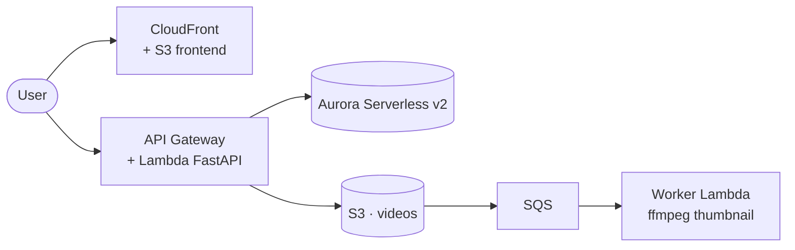

# Mini Loom

> A serverless video-sharing platform on AWS - upload a video, get a shareable link.

**Live demo:** `https://d2kjs0fj08999z.cloudfront.net`

## Architecture



## Stack

| Layer | Technology |
|---|---|
| Frontend | React + Vite, S3 + CloudFront (OAC) |
| Backend | FastAPI on Lambda, API Gateway |
| Database | Aurora Serverless v2 (PostgreSQL) |
| Auth | Amazon Cognito federated to Google (OIDC) |
| Infrastructure | Terraform |
| CI/CD | GitHub Actions |

Everything is provisioned with Terraform. On push to `main`, GitHub Actions authenticates to AWS via OIDC, runs the tests, builds and pushes the Lambda image to ECR, applies the infrastructure, and deploys the frontend to S3 + CloudFront.

## Design decisions

- **RDS Data API, not a NAT Gateway** - Lambda reaches Aurora over HTTPS instead of joining the VPC, avoiding a ~$33/mo NAT Gateway.
- **Aurora scales to zero** - `MinCapacity=0` pauses compute when idle; the trade-off is a ~15s cold-start resume, which the backend retries through.
- **Cognito + Google** - authentication is delegated to Cognito, removing password storage and resets; the API verifies Cognito's JWTs against the pool's public keys.
- **SQS between upload and thumbnailing** - an S3 event feeds a queue that triggers a worker Lambda (ffmpeg); decoupling the slow work gives free retries and a dead-letter queue.
- **Cost as a constraint** - a $5 budget with tiered alerts and an automated brake; 30-day log retention; least-privilege IAM.

Measured idle cost: ≈ $0.70/month.

## Run locally

```bash
# Backend (SQLite, no AWS needed)
cd backend && pip install -r requirements-dev.txt && python -m pytest
uvicorn app.main:app --reload

# Frontend
cd frontend && npm install && cp .env.example .env && npm run dev
```
